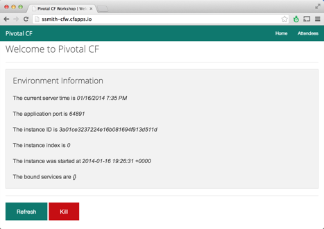

Goals
* Login to PCF environment
* Push applications using CLI prompts
* Access deployed applications
 
Steps

1. Using the CLI login to PWS using the user name and password for your cloud foundry account
 
  `* cf login -a api.run.pivotal.io`
 
   * Follow prompts to supply user name and password
 
2. Using the CLI push the built application
 
   * `cf push <app-name> -p dist/cf-workshop-spring-mvc-0.1.war`
 
   * Your app-name should be: `<first_initial><last_name>-CFW (e.g “jsmith-CFW”)`
 
3. After application deploys and starts open a browser and navigate to the application.  The path to the application is supplied in the “urls” parameter similar to the following:

  
 

