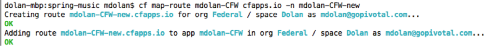
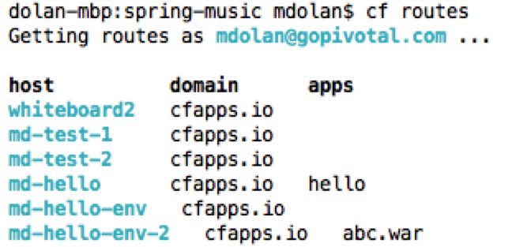
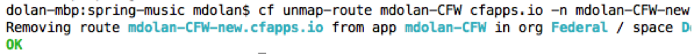
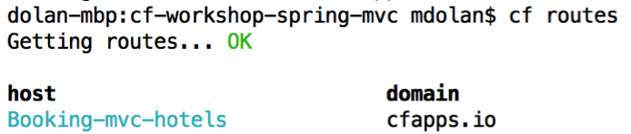
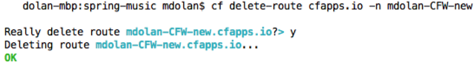

Goals

* Deploy application
* Map a new URL Subdomain to the application

Steps

1. Get information about deployed app using CLI command

* `cf apps`

* Note the deployed application name.

2. Map a new URL to the application 

* `cf map-route <app_name> cfapps.io –n <app_name>-new`
* Where <app_name> is the app name recorded in step 1.  
	

3. Verify the new URL route was created in the space.  You should see the new host domain combination listed

* `cf routes`

4. Open a browser and navigate to the application using the new URL route.

5. Unmap the new URL to the application 

* `cf unmap-route <app_name> cfapps.io –n <app_name>-new`
* Where `<app_name>` is the app name recorded in step 1.  

 
6.List the routes for the space

* `cf routes`
 
* The route still exists because we have unmapped the route, but not deleted the route, so it is reserved for our future use.

7.Attempt to map a route to a reserved URL 

`cf map-route <app_name> cfapps.io –n cfworkshop-reserved`

* You will see this fails as this has already been reserved.
 

8. Delete the route (this will also unmap the route)

`cf delete-route cfapps.io –n <app_name>-new`

* When prompted confirm you want to delete the route.  

 
9. Verify the route has been deleted

* `cf routes`

